# 01 · 업무보고 PPT 자동화

> **과제** — 제공된 부산대학교 「2026 업무보고 서식」의 포맷을 모방하는 스킬을 만들고,
> 총무과 주요업무보고 내용을 어떻게 반영할지 기획해 결과물 PPT 샘플까지 제출

| | |
|---|---|
| 입력 | `2026 업무보고 서식 1부.pptx` (9매, 자리표시자 상태) · `총무과 주요업무 추진실적 서식.hwpx` · 부산대 로고 `.ai` |
| 산출물 | 재사용 스킬 1종 + [총무과 2026 주요업무보고 20매](output/) + [반영 기획안](output/총무과_2026_주요업무보고_PPT_기획안.md) |
| 도구 | Claude Code, python-pptx, Pillow, PyMuPDF |

---

## 문제 정의

원본 서식은 **자리표시자만 들어 있는 상태**(`OOOO과`, `가나다라마바사`)였다.
그래서 그대로 텍스트만 갈아 끼우면 두 가지가 동시에 깨진다.

1. **내용량이 다르다.** 한글 원고는 결재용이라 한 과제가 A4 1~2쪽이고 계층 불릿이
   4단까지 내려간다. 슬라이드에 그대로 옮기면 한 장에 40줄이 넘는다.
2. **레이아웃이 하나뿐이다.** 원본 본문 레이아웃은 계층 불릿 한 종류라, 표나 수치
   비교가 필요한 내용을 담을 자리가 없다.

그래서 **디자인 토큰은 원본에서 추출해 고정하고, 본문은 내용 형태에 맞춰 조립**하는
빌더로 만들었다.

## 접근 방법

### 1. 원본 XML에서 디자인 토큰 추출

`.pptx`를 풀어 색·서체·좌표·도형 경로를 직접 읽어냈다. 눈대중으로 맞추지 않았다.

| 항목 | 추출값 |
|---|---|
| 주색 / 강조색 | `#1C4FA1` / `#2DA7E0` |
| 본문 먹색 | `tx1 lumMod 85%` → `#262626` |
| ※ 노트 밴드 | `tx2(0E2841) lumMod 10 / lumOff 90` → `#DCEAF7` |
| 서체 | 페이퍼로지 4/5/6/7/9 Black, 공체 Bold |
| 헤더 탭 | custGeom `w=581025 h=644664`, 아래 두 모서리 R=144466, 채움+윤곽 이중 |
| □ 마커 | 정사각형 2개를 한 변의 23%만큼 어긋나게 겹침 |

자세한 내용은 [`skill/references/design-tokens.md`](skill/references/design-tokens.md).

### 2. 임베드 서체 보존

원본 pptx는 페이퍼로지를 `p:embeddedFontLst`로 품고 있다. 슬라이드를 새로 만들면
이 정보가 사라져 서체가 깨진다. 그래서 **원본에서 슬라이드만 제거한 `base.pptx`를
만들어 그 위에 슬라이드를 쌓는 방식**을 택했다. 폰트 미설치 PC에서도 정상 표시된다.

> 정리 중에 `base.pptx`의 14.1MB 가운데 **12.4MB가 맑은 고딕 임베드 데이터**임을
> 발견했다. 이 빌더는 맑은 고딕을 쓰지 않고 Microsoft 독점 서체라 재배포도
> 불가하므로 제거했다. **14.1MB → 1.7MB**, 산출물도 16.3MB → 3.9MB로 줄었다.

### 3. 커서 기반 레이아웃 조립

`ContentSlide`가 세로 커서(`s.y`)를 들고 있고, 블록을 쌓을 때마다 텍스트 높이를
추정해 커서를 내린다. 좌우 분할은 `push()` / `pop()`으로 작업 영역을 좁힌다.

```python
s = d.content(1, "효율적인 인력 운영을 위한 행정직원 총괄 관리 기반 구축")
s.push(BODY_L, 7.28)                       # 좌측 컬럼
s.section("주요 성과")
s.bullets([(1, "(실태조사 체계 정립) **연 2회 정기 조사**를 실시하여 …"),
           (2, "분산 관리되던 인력정보를 통합 파악")])
s.note("(’25. 4.) 무기계약직 현황 조사(총무과-6441)")
s.pop()
s.panel(8.28, 1.24, 4.34, 2.44, title="한계", fill=NAVY, items=[...])   # 우측 패널
s.check()                                  # 하단 넘침 경고
```

한글 보고서 관례에 맞춰 **문두 괄호 `(실태조사 체계 정립)`는 자동으로 남색 볼드**가
되고, `**강조**`는 남색(남색 배경에서는 밝은 하늘색)으로 전환된다.

### 4. 로고 교체

원본 각 슬라이드의 80주년 기념 로고를 **부산대학교 엠블럼**으로 대체했다.
제공된 `.ai` 파일이 PDF 1.4 컨테이너라 PyMuPDF로 8배 렌더링 후 알파 크롭해
1140×1140 투명 PNG를 뽑았다.

| 위치 | 처리 |
|---|---|
| 표지 | 화이트 모노 엠블럼, 우측 사진 패널 중앙, 투명도 52% |
| 본문 헤더 | 컬러 엠블럼 + 세로 구분선 + `부산대학교 / PUSAN NATIONAL UNIVERSITY` 락업 |
| 목차 | 상단 흰 띠 우측에 컬러 엠블럼 |
| 마무리 | 화이트 엠블럼 |

## 레이아웃 9종

| # | 메서드 | 쓰임 |
|---|---|---|
| L1 | `cover()` | 표지 — 캠퍼스 사진 + 남색 그라데이션 베일 |
| L2 | `toc()` | 목차 — 스카이라인 띠 + 번호 원 + 점선 커넥터 |
| L3 | `divider()` | 간지 — 45° 남색 그라데이션 |
| L4 | `bullets()` | 계층 불릿 (◦ / － / ※) |
| L5 | `note()` | ※ 근거·수치 강조 밴드 |
| L6 | `panel()` + `push()` | 좌우 분할 — 개요 패널 + 항목 나열 |
| L7 | `table()` | 표 — 남색 머리행, 셀 내 `**강조**` 지원 |
| L8 | `kpi()` `cards()` `steps()` `compare()` | 인포그래픽 |
| L9 | `closing()` | 마무리 |

전체 API는 [`skill/references/layout-catalog.md`](skill/references/layout-catalog.md).

## 총무과 내용 반영 기획

원문은 3장 24항목(성과 6 · 계획 4 · 공약 14) 규모다. 이를 20매로 재구성했다.

**반영 원칙**

1. 원문 문장을 지어내지 않는다. 수치·날짜·문서번호는 원고 그대로.
2. 계층 불릿 위계(◦ / - / ※)를 슬라이드 1/2/3단계에 그대로 매핑 — 결재 문서와
   대조하며 읽을 수 있어야 한다.
3. **수치가 있는 항목만** 인포그래픽으로 승격. 서술만 있는 항목은 그대로 둔다.
4. 「한계」를 숨기지 않고 남색 패널로 세운다. 원문이 성과/한계를 대칭으로 쓰고 있어
   좌우 분할이 구조적으로 맞는다.
5. 장마다 총괄 슬라이드를 1장 신설 — 원문에는 없지만 발표에는 필요하다.

**수치 승격 예**

| 원문 위치 | 원문 표현 | 슬라이드 표현 |
|---|---|---|
| 성과3 ※ | "3개 캠퍼스 5,009개실 구축 완료" | KPI 카드 `5,009 개실` |
| 성과4 ※ | "(부산) 급속 4·완속 48 …" 긴 한 줄 | 캠퍼스×충전유형 표 (합계행 강조) |
| 성과5 ※ | "('24년) 100건 → ('25년) 135건" | 연도 대비 표 |
| 성과6 표 | AS-IS/TO-BE 2×2 한글 표 | Before ➡ After 비교 패널 |

전체 슬라이드별 매핑은 [반영 기획안](output/총무과_2026_주요업무보고_PPT_기획안.md)에 있다.

## 슬라이드 미리보기

### 표지 · 목차 · 간지

| 표지 | 목차 |
|---|---|
| 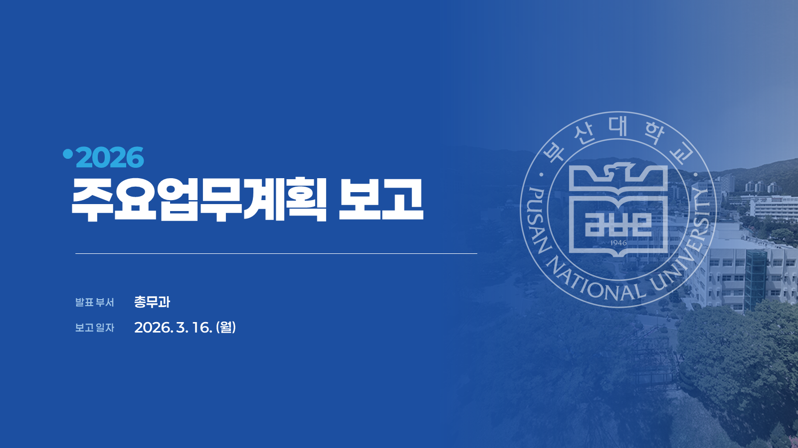 | 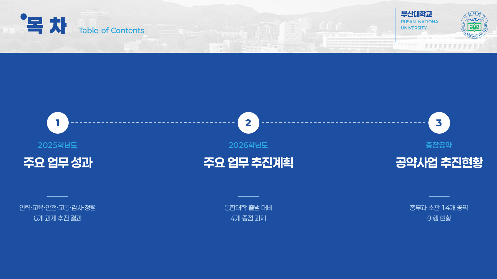 |

| 간지 | 마무리 |
|---|---|
|  | 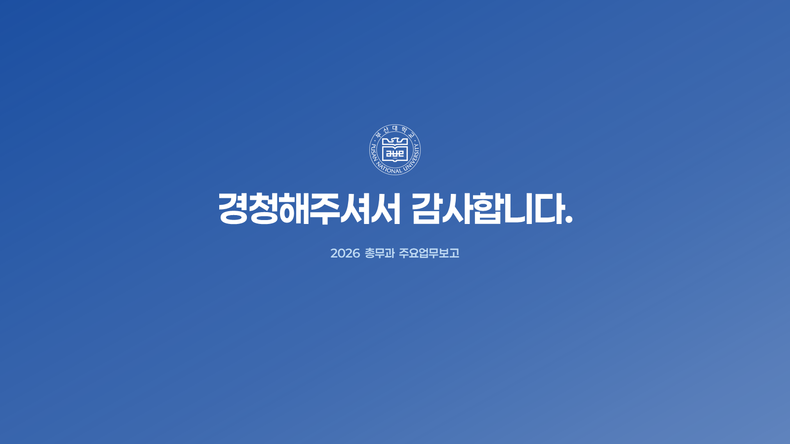 |

### 본문 — 레이아웃별

**총괄 (KPI 카드 + 항목 카드)**

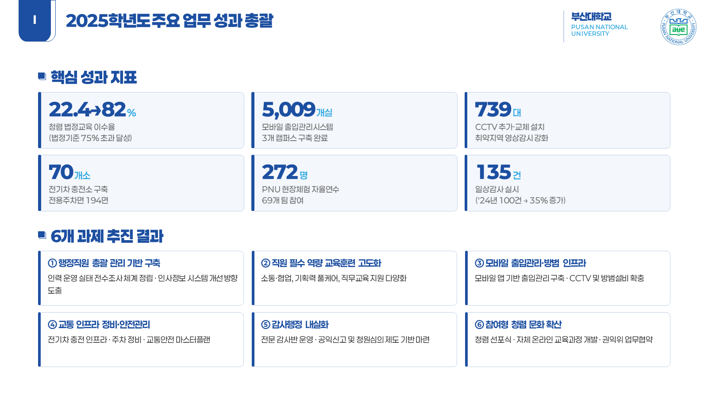

**좌우 분할 (성과 / 한계·개선방향)**

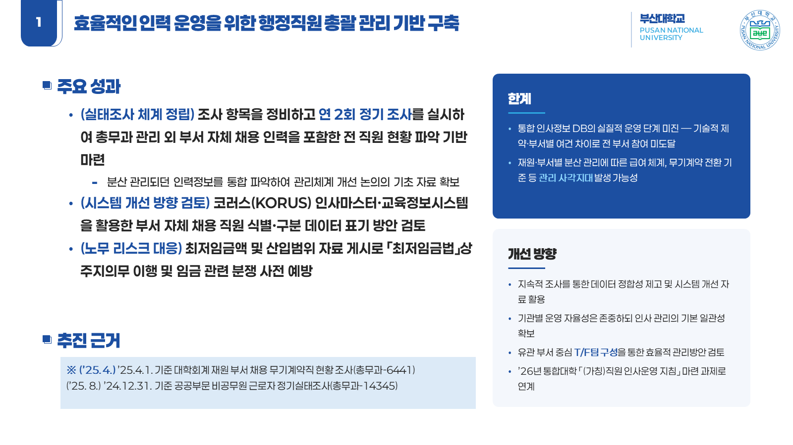

**표 + 카드 (교통 인프라)**

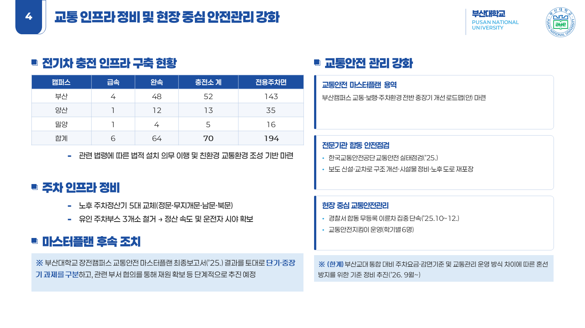

**연도 대비 표 (감사 실적)**

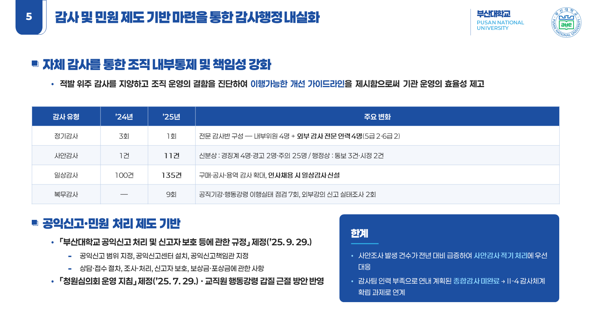

**Before ➡ After 비교 (청렴 교육 이수율)**

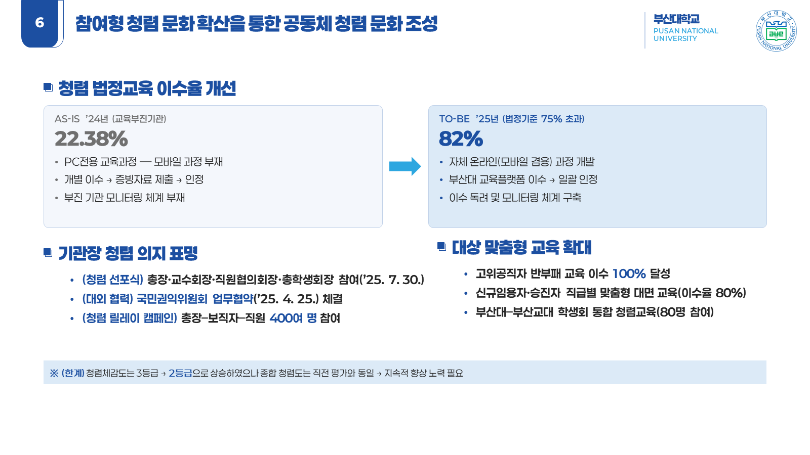

**단계 다이어그램 (인사운영 지침 3단계)**

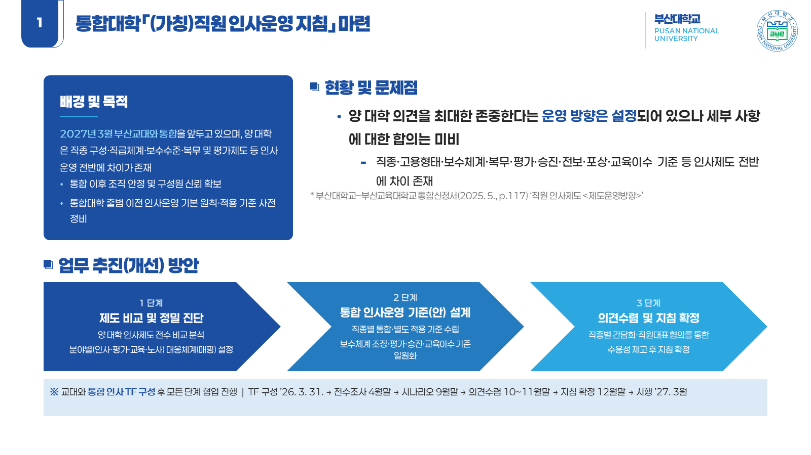

**일정 매트릭스**

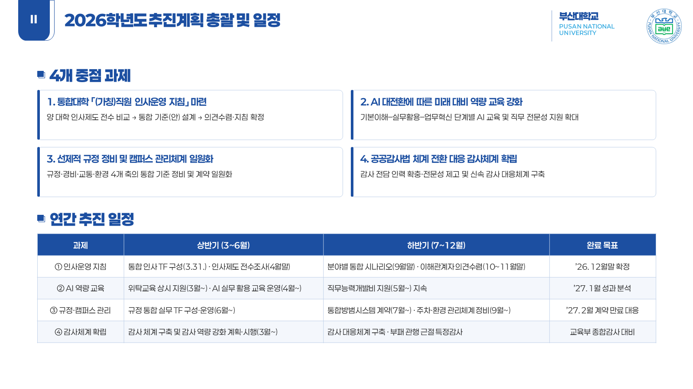

**표 2단 분할 (공약 14건)**

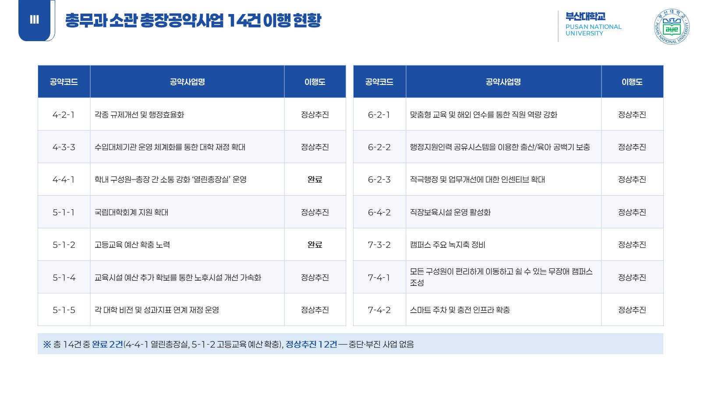

<details>
<summary>전체 20매 보기</summary>

| | |
|---|---|
| 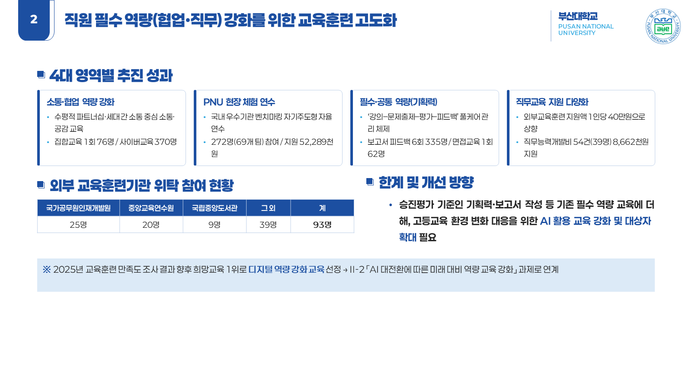 | 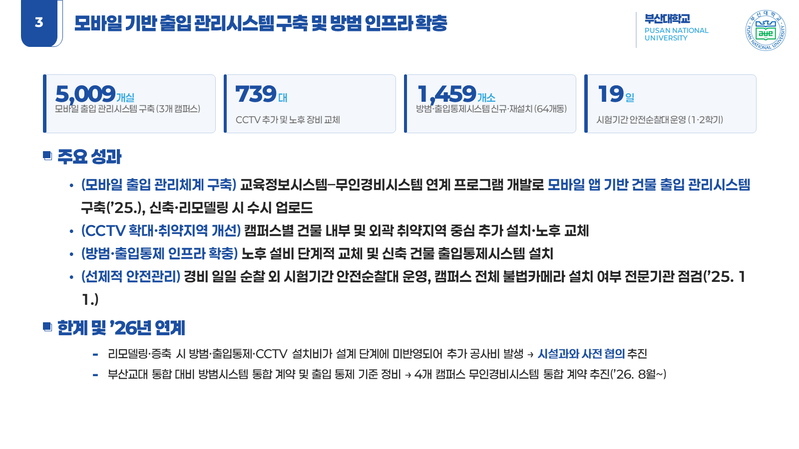 |
|  | 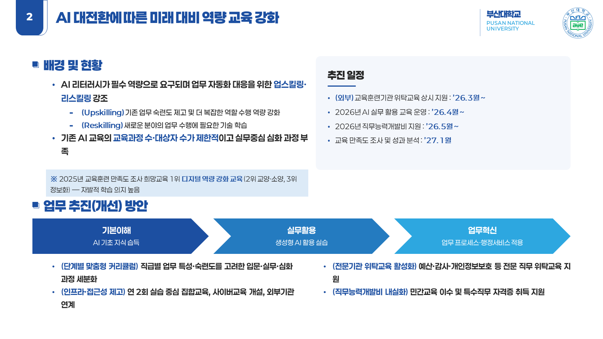 |
| 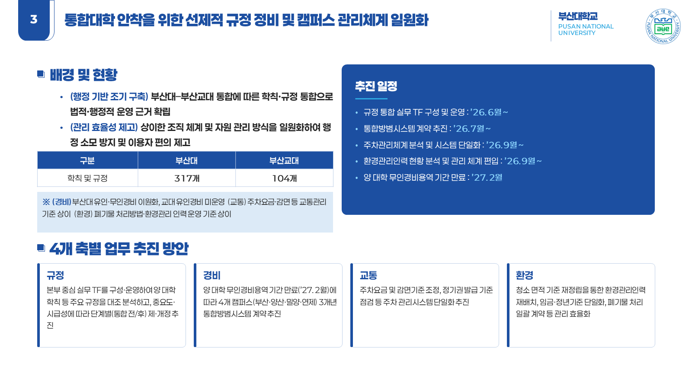 | 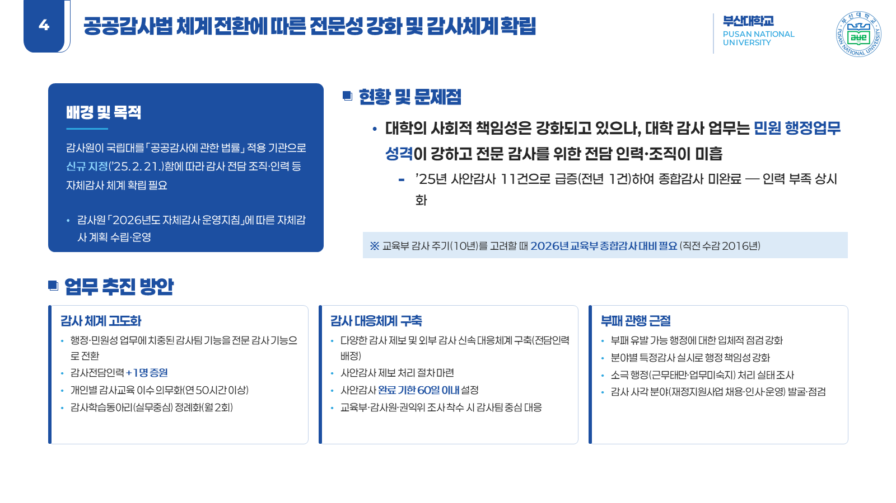 |
|  | 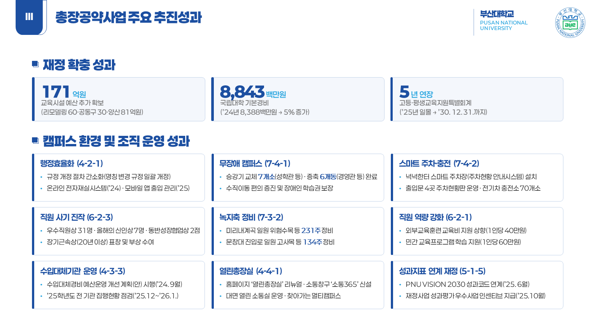 |

</details>

## 재현 방법

```bash
pip install python-pptx pillow
python skill/scripts/build_chongmu_2026.py "총무과_2026_주요업무보고.pptx"
```

다른 부서 보고서는 `build_chongmu_2026.py`를 복사해 내용만 교체하면 된다.

## 배운 것

- **`.hwpx` 파싱 함정** — `<hp:t>` 의 `.text`만 이으면 `<hp:fwSpace/>` 뒤의 `tail`이
  누락돼 날짜·수치가 잘린다(`’26. 3. 31.` → `’26.`). 처음 추출본에서 추진일정이
  전부 비어 있었고, tail까지 이어 붙여 해결했다.
- **줄높이 추정 보정** — PowerPoint의 실측 행높이는 `글자크기 × 행간비율`보다 약 7%
  크다. 이 계수(`LINE_FACTOR = 1.07`)를 빼먹으면 블록이 서로 겹친다.
- **`xml:space="preserve"`** — python-pptx로 만든 런의 앞뒤 공백이 PowerPoint에서
  사라진다. `관리 사각지대` + ` 발생` 이 `관리 사각지대발생`으로 붙어 나왔다.
- **표 셀 괘선 순서** — `tcPr` 자식은 `lnL·lnR·lnT·lnB`가 맨 앞이어야 스키마가 통과한다.
- **결과는 눈으로 확인해야 한다** — PowerPoint COM으로 20매를 PNG로 뽑아 검수했고,
  쉐브론 도형의 화살표 노치 때문에 텍스트가 넘치는 문제 등을 그때 발견했다.
