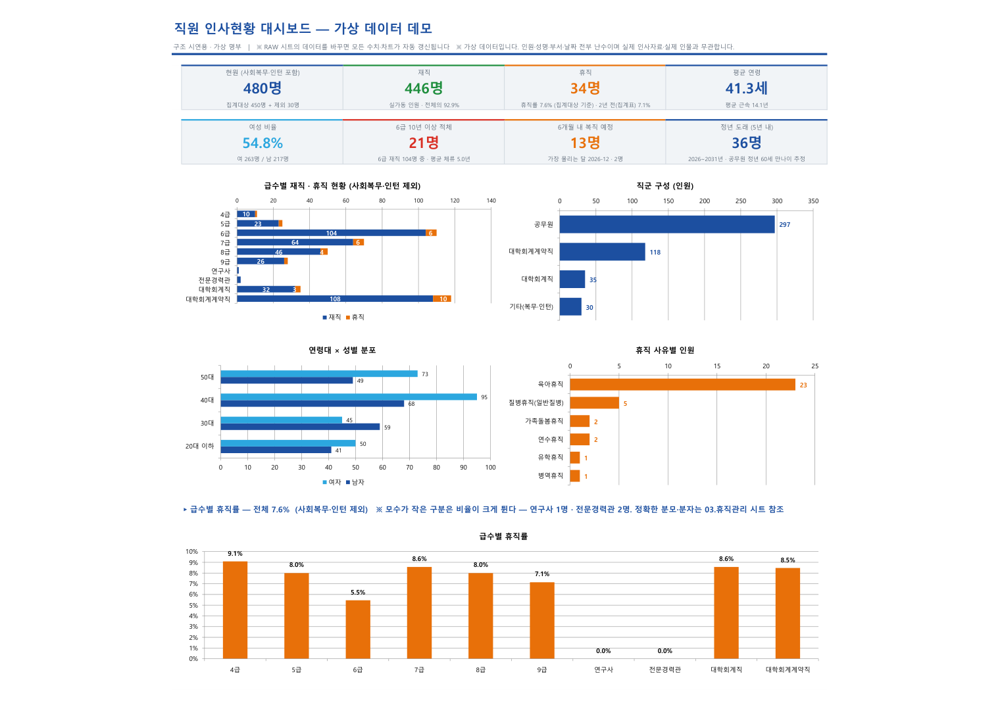
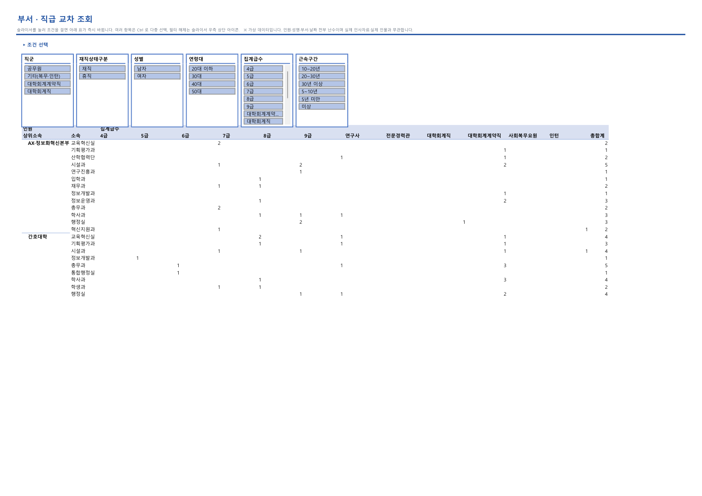
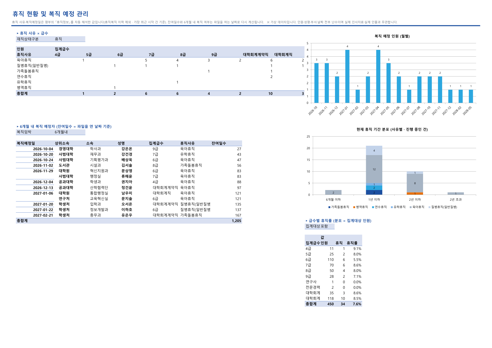
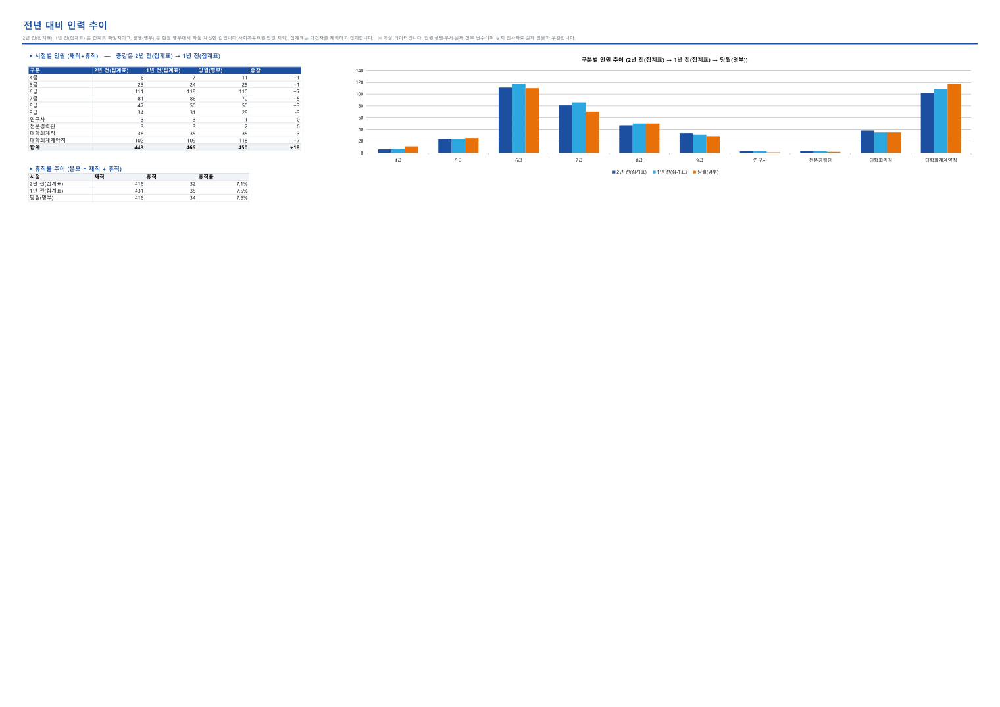
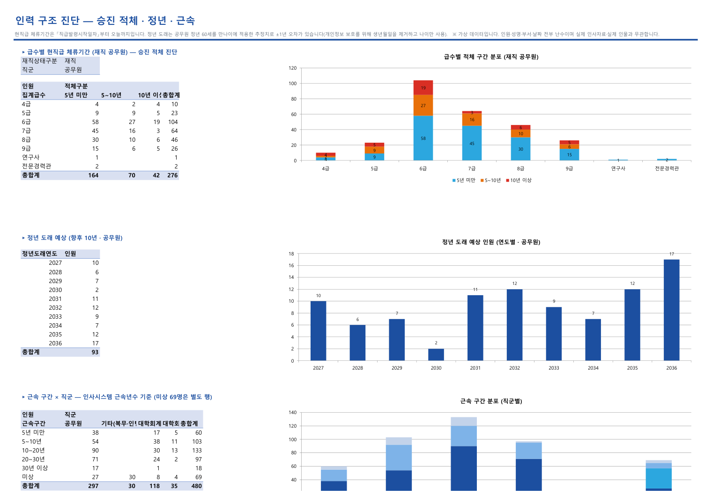
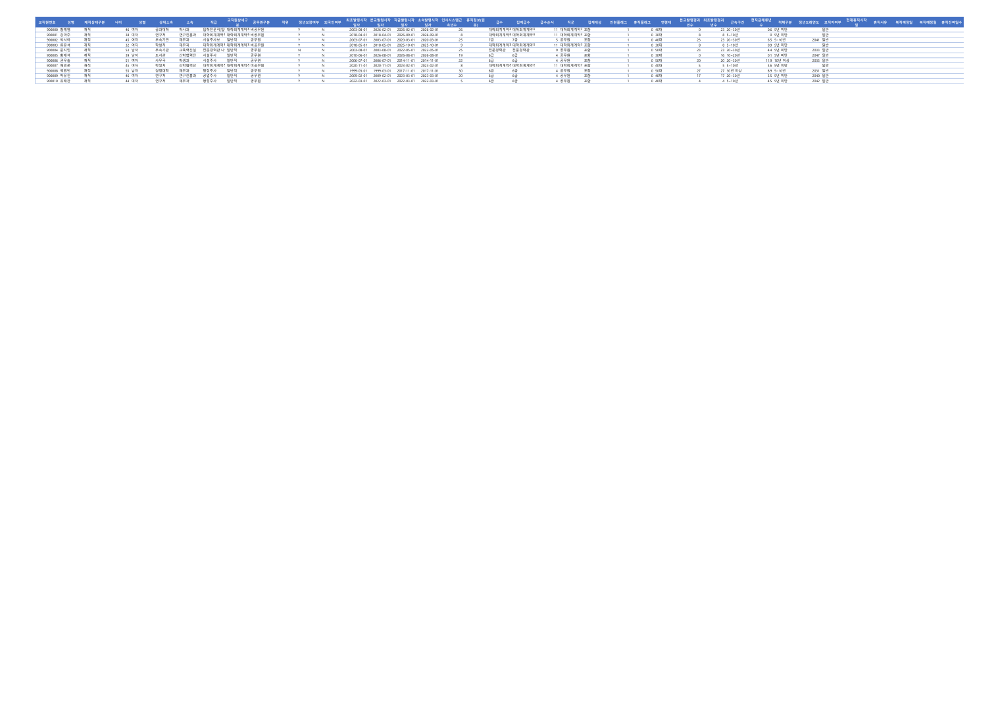
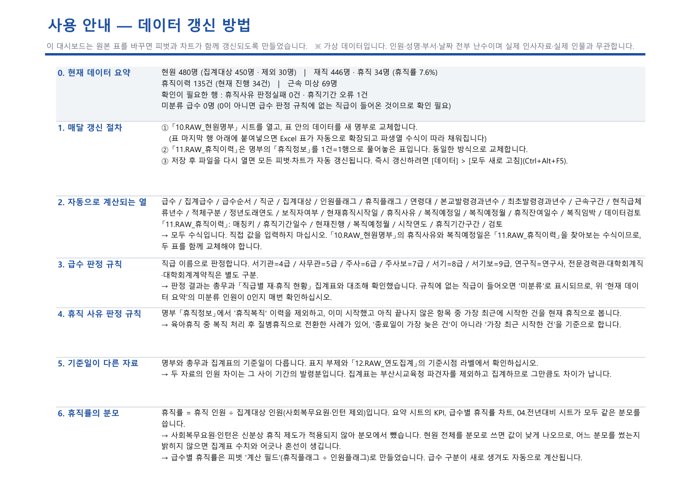

# 02 · 인사현황 엑셀 대시보드 자동화

인사시스템에서 내린 **현원 명부 엑셀 한 장**을 받아, 데이터를 바꾸면 피벗과 차트가
함께 갱신되는 대시보드를 만드는 자동화 작업입니다.

- **과제** AI 마에스트로 교육과정 2회차 — 부서 raw data 기반 엑셀 대시보드 제작
- **수행지침** 데이터가 바뀌면 피벗·차트가 자동 갱신되도록 구성
- **결과** 시트 10장 · 피벗테이블 19 · 피벗차트 11 · 슬라이서 6

> **공개 범위 안내**
> - **산출물(대시보드)** 은 **가상 데이터로 만든 데모**를 공개합니다. 실제 적용본은
>   직원 개인정보를 포함하므로 공개하지 않습니다. 데모는 실제와 **열 구조와 값의
>   형태만** 같고 인원·성명·부서·날짜가 전부 난수이며, 실제 인물·실제 인사 수치와
>   무관합니다. 모든 시트 부제에 그 사실을 붉은 글씨로 표시했습니다.
> - **빌드 도구(스킬)** 는 부산대학교 내부 인사 업무용이라 이 저장소에 포함하지
>   않았습니다. 아래에 어떤 설계로 만들었는지 정리했습니다.

---

## 무엇이 문제였나

인사 현황은 매달 새로 뽑습니다. 그런데 명부를 새로 받으면 피벗 범위를 다시 잡고,
급수·연령대 같은 분류 열을 다시 채우고, 차트를 다시 손봐야 했습니다.
**한 번 만든 대시보드가 다음 달에 그대로 쓰이지 않는 것**이 문제였습니다.

원자료에는 분석에 필요한 열이 아예 없기도 했습니다.

- **급수가 없다.** `직급` 열에 「행정주사」·「대학회계계약직(사무실무직)」처럼 수십 종이
  섞여 있고, 4급~9급 구분은 어디에도 없습니다.
- **휴직 사유가 한 칸에 뭉쳐 있다.** `휴직정보` 열에
  `휴직복직[20240923~99991231], 육아휴직[20260701~20270630], …` 처럼 이력이 누적됩니다.

## 어떻게 풀었나

### 1. 파생열을 '값' 이 아니라 '수식' 으로 넣는다

이 작업의 핵심입니다. 급수·연령대·휴직사유·복직예정일 같은 열을 파이썬으로 계산해
값만 써 두면, 새 명부를 붙여넣었을 때 그 칸이 **빈 채로 남아 피벗이 깨집니다.**

그래서 파이썬은 원본 열만 옮기고, 파생열 20개는 **Excel 표(ListObject)의 구조적 참조
수식**으로 넣었습니다. Excel 표는 행이 늘어나면 계산 열을 자동으로 채우므로,
명부를 교체하는 것만으로 모든 분류가 따라옵니다. 피벗 캐시에는 `RefreshOnFileOpen` 을
걸어 파일을 열 때 갱신되게 했습니다.

```
급수 = IFS(교직원상세구분="대학회계계약직", "대학회계계약직",
           … ISNUMBER(SEARCH("주사보", 직급)), "7급",
             ISNUMBER(SEARCH("주사",   직급)), "6급",
             ISNUMBER(SEARCH("서기보", 직급)), "9급",
             ISNUMBER(SEARCH("서기",   직급)), "8급", …)
```

`주사보` 를 `주사` 보다, `서기보` 를 `서기` 보다 먼저 검사해야 합니다. 순서를 바꾸면
「행정주사보」가 6급으로 잘못 잡힙니다. Excel 2019/2021 에는 `TEXTSPLIT`·`FILTER`·
`XLOOKUP` 이 없어서, 그 제약 안에서 쓸 수 있는 함수로만 짰습니다.

`휴직잔여일수`·`복직임박` 은 `TODAY()` 기반이라 **파일을 여는 날짜로 다시 계산**됩니다.

### 2. 한 칸에 뭉친 휴직 이력을 행으로 푼다

`휴직정보` 문자열을 정규식 `([^,\[\]]+)\[(\d{8})~(\d{8})\]` 으로 분해해
**1건 = 1행** 표로 만들고, 명부는 그 표를 찾아보는 방식으로 사유와 복직예정일을
가져옵니다. 한 사람이 휴직을 여러 번 쓰므로, 1인 1행인 명부로는 건 단위 분석을
할 수 없기 때문입니다.

여기서 판정 규칙이 중요했습니다.

> **현재 휴직 = `휴직복직` 이력을 제외하고, 이미 시작했고 아직 끝나지 않은 것 중
> 가장 최근 시작한 건**

'종료일이 가장 늦은 건' 으로 잡으면 안 됩니다. 육아휴직 중 복직 처리를 하고 같은 날
질병휴직으로 전환한 사례가 있었는데, 종료일은 육아휴직이 더 늦지만 현재 상태는
질병휴직입니다. 별도 관리 자료와 대조해 확인했습니다.

또 `휴직복직` 행과 사유 행의 **시작일이 같은 사람이 여럿** 있어(같은 날 전환),
찾아보기 키를 만들 때 `휴직복직` 행을 빼야 엉뚱한 값이 잡히지 않습니다.

### 3. 급수별 휴직률은 피벗 계산 필드로

개수 기반 '행 합계 비율' 을 쓰면 열 항목을 숨길 때 분모가 바뀌어 100%로 왜곡됩니다.
그래서 1/0 숫자 열(`인원플래그`·`휴직플래그`)을 두고 계산 필드
`휴직률 = 휴직플래그 ÷ 인원플래그` 로 만들었습니다. 급수 구분이 새로 생겨도
자동으로 계산됩니다.

분모는 파일 안 모든 곳에서 **집계대상(사회복무요원·인턴 제외)** 으로 통일했습니다.
그 신분에는 휴직 제도가 적용되지 않는데, 분모를 섞으면 같은 파일에서 휴직률이
세 가지로 갈립니다.

---

## 결과물

| 시트 | 내용 |
|---|---|
| `01.요약` | 보고용. KPI 카드 8 + 차트 5 |
| `02.교차조회` | 실무용. 부서×급수 피벗 + 슬라이서 6종 |
| `03.휴직관리` | 사유×급수, 복직 예정 월별, 휴직 기간 분포, 6개월 내 복직 예정자, 급수별 휴직률 |
| `04.전년대비` | 확정 집계 시점 + 현재 시점(명부 자동계산) 비교 |
| `05.인력구조` | 승진 적체(현직급 체류기간), 정년 도래, 근속 구간, 보직자 |
| `10~12.RAW` | 현원명부 / 휴직이력 / 연도집계 — **여기를 교체하면 전부 갱신** |
| `99.사용안내` | 갱신 절차·판정 규칙·원자료 한계. 맨 위 요약은 수식이라 항상 맞음 |

📂 [**파일 내려받기**](output/) — 대시보드 데모와, 그 재료로 쓴 **가상 현원명부**(.xlsx).
명부 쪽을 보면 원자료가 어떤 열로 들어오는지, 대시보드가 그 위에 어떤 파생열을
얹는지 비교할 수 있습니다.

### 미리보기

**요약 (보고용)** — KPI 카드와 5개 차트



**부서 · 직급 교차 조회** — 슬라이서로 조건을 걸면 표가 즉시 바뀝니다



**휴직 현황 및 복직 예정 관리** — 복직이 몰리는 달과 6개월 내 복직 예정자



**전년 대비 인력 추이** — 기준시점 라벨을 표에서 읽으므로 시점을 늘려도 동작합니다



**인력 구조 진단** — 승진 적체 · 정년 도래 · 근속 구간



**RAW 시트** — 파생열이 모두 수식입니다. 여기를 교체하면 위 전부가 갱신됩니다



**사용 안내** — 맨 위 '현재 데이터 요약' 은 수식이라 명부를 교체해도 항상 맞습니다



---

## 자동 갱신을 실제로 검증했다

"자동 갱신된다" 는 말만으로는 부족해서, 사본에 인원을 추가해 수식·피벗·차트가 함께
움직이는지 확인하는 검증 스크립트를 따로 만들었습니다.

```
=== 1) 파생열 자동 채움 ===
  급수 · 직군 · 집계대상 · 연령대 · 적체구분 · 휴직사유 · 복직예정월 · 복직임박 …  전부 OK
=== 2) 요약 수식(KPI) 반영 ===
  현원 +2 · 재직 +1 · 휴직 +1 · 급수별 +1 …  전부 OK
=== 3) 피벗 새로고침 후 차트 반영 ===
  급수별 차트 합 +2 · 적체 차트 합 +1 · 피벗 값 +1  OK
  7급 휴직률 재계산  OK
=== 4) 파일 열 때 자동 새로고침 설정 ===
  피벗캐시 3개 모두 RefreshOnFileOpen = True

자동 갱신 검증 통과
```

빌드 과정 끝에서도 **50여 개를 자동으로 확인**합니다. 기대값은 하드코딩하지 않고
**엑셀 수식과 같은 규칙을 파이썬으로 다시 구현해 계산**하므로, 두 구현이 어긋나면
바로 드러납니다.

- 구조 불변식 — 재직+휴직=현원, 휴직사유 판정실패 0, 휴직이력 진행건수=휴직 인원,
  미분류 급수 0
- 교차검증 — 급수별·사유별·근속구간별 인원을 파이썬 계산값과 대조

급수 판정은 총무과 「직급별 재·휴직 현황」 집계표와 대조해 **전 구분이 일치**함을
확인했습니다. 두 자료의 인원 차이가 전 구분의 증감 합계와 정확히 맞아, 그 차이가
기준일 사이의 발령분임을 확인하는 방식으로 검증했습니다.

원자료의 이상은 **임의로 고치지 않고** `데이터검토` 열에 표시만 합니다
(휴직 시작일이 종료일보다 늦은 행 등).

---

## 원자료가 답하지 못하는 것은 만들지 않았다

1. **부서별 휴직 분석** — 휴직 발령 시 소속이 본부로 바뀌어, 휴직자 대부분의 상위소속이
   본부로 기록됩니다. 원래 근무 부서를 알 수 없습니다.
2. **연도별 휴직 개시 추이** — `휴직정보` 의 사유 항목은 최근 2~3년치만 남고 그 이전은
   `휴직복직` 기록으로만 남습니다. 추이로 쓰면 "특정 연도에 급증" 처럼 오독됩니다.
3. **정원 · 결원 · 충원율** — 직제 정원 자료가 명부에 없습니다. 휴직자를 뺀 '재직 인원' 을
   실가동 인원 지표로 대신 씁니다.
4. **근속년수** — 발령일자로 계산하면 인사시스템 값과 어긋납니다(군경력 등 산입 경력).
   `본교발령시작일자` 는 재발령 때 갱신되어 근속이 아니고, `최초발령시작일자` 로 계산해도
   정확히 맞는 비율이 10%가 안 됩니다. 그래서 인사시스템 값을 그대로 씁니다.

못 만드는 이유를 `99.사용안내` 시트에 적어 두는 편이, 그럴듯한 숫자를 만들어 두는
것보다 낫다고 판단했습니다.

---

## 배운 것

**"자동 갱신" 은 만드는 방식이 아니라 검증하는 방식의 문제였습니다.** 파생열을 수식으로
넣는 설계까지는 금방 갔지만, 실제로 갱신되는지 확인하는 스크립트를 만들고 나서야
빠진 곳들이 보였습니다.

특히 **가상 데이터로 한 번 돌려본 것이 결정적이었습니다.** 실제 데이터에서는 값이
우연히 맞아 정상처럼 보였던 결함 네 개가 데모에서 드러났습니다.

- `04.전년대비` 시트의 표가 전부 `0` — `SUMIFS` 가 기준시점 라벨을 하드코딩하고 있었음
  (차트는 피벗이라 정상이어서 표만 0으로 남아 눈치채기 어려웠습니다)
- KPI 카드의 전년 휴직률이 하드코딩 — 다른 데이터에서는 거짓이 되는 값
- 차트 제목에 건수가 박혀 있음
- 기준시점이 가나다순으로 정렬돼 시간 순서가 뒤집힘 (실제 라벨은 우연히 맞았음)

**Excel COM 자동화의 함정도 정리했습니다.** 늦은 바인딩에서 `Worksheets.Add(After=)` 의
명명 인자가 무시되는 것, 피벗의 페이지필터가 앵커 *위쪽* 행을 차지해 섹션 제목을 덮는 것,
`RefreshAll()` 이 피벗차트 라벨 서식을 초기화해 가독성 조정을 새로고침 *뒤에* 다시
해야 하는 것, 피벗차트가 조각별 라벨 설정을 저장하지 않아 도넛 대신 가로 막대로 가야
했던 것, `PageSetup` 이 `PrintCommunication=False` 상태에서 조용히 무시되는 것 등입니다.

**공개 준비도 작업의 일부였습니다.** Excel 은 저장할 때 **파일이 있던 폴더의 절대경로를
`xl/workbook.xml` 에 통째로 넣습니다**(`x15ac:absPath`). 화면에는 안 보이지만 파일을
열어보면 그대로 읽힙니다. 그리고 가상 명부의 직급 가중치를 실제 분포에서 그대로
가져왔더니 직군별 인원이 실제와 **완전히 일치**해, '가상 데이터' 라면서 실제 수치를
공개하는 상황이 될 뻔했습니다. 둘 다 공개 전 검사에서 잡아 고쳤습니다.
