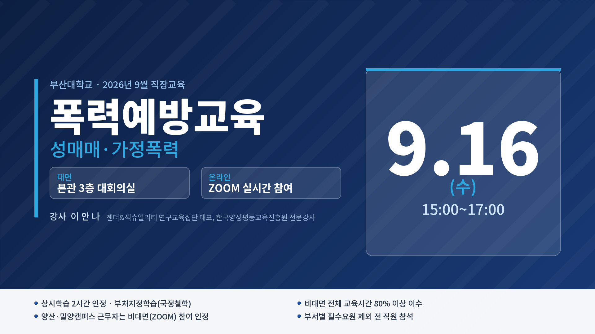
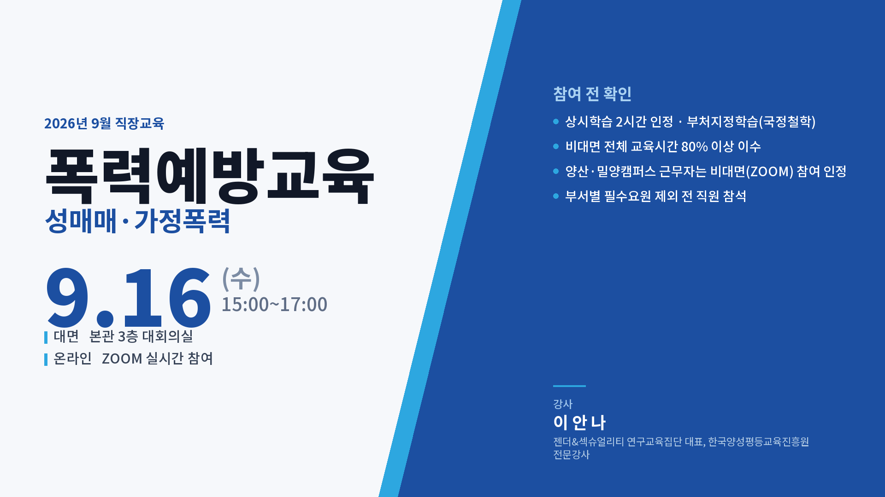

# 직장교육 안내 포스터 만들기 에이전트

**AI 마에스트로 3회차 과제** — 작은 반복 업무 1건을 수행하는 에이전트 시제품
부산대학교 총무과 · 2026. 9.

매달 직장교육 계획(안)이 결재되면 그 내용을 보고 안내 포스터를 만들어 학내
구성원(교원·조교·직원)에게 배포한다. **계획안에 이미 있는 내용을 사람이 다시
옮겨 적는 일**이라, 그 부분을 에이전트에 맡겼다.

```
계획(안) PDF/HWPX  →  [추출]  →  [일러스트 — 사람]  →  [조판]  →  포스터 이미지
```

가운데 일러스트 한 칸만 사람이 하고, 나머지는 코드가 한다.

---

## 결과물


**2026년 9월 · 폭력예방교육(성매매, 가정폭력)** — 1920×1080 / 254KB
→ [원본 파일](output/2026-09_직장교육_안내포스터_1920x1080.jpg)

포스터에 찍힌 날짜·시간·장소·강사·이수기준은 **전부 계획안에서 뽑은 값**이다.
사람이 입력한 글자는 한 자도 없다.

---

## 핵심 설계 — 글자는 생성 AI에 맡기지 않는다

처음엔 생성 AI에 포스터를 통째로 맡기려 했다. 그런데 참고로 받은 생성형 인포그래픽을
확대해 보니 한글이 틀려 있었다.

| 찍힌 글자 | 올바른 글자 |
|---|---|
| 규정이 **장한** 사유 없이 | 규정이 **정한** 사유 없이 |
| 특별한 **공작이** 있는 | 특별한 **공적이** 있는 |

그림으로선 사소해 보여도 **전 구성원에게 배포하는 공문서에서는 결함**이고, 매달
반복하는 업무라면 매번 사람이 눈으로 잡아야 한다. 자동화의 취지와 어긋난다.

그래서 역할을 갈랐다.

| 담당 | 하는 일 |
|---|---|
| 생성 AI | **글자 없는** 일러스트만 |
| 코드 | 모든 글자 — 계획안에서 뽑은 값 그대로 조판 |

이러면 날짜·강사명·이수기준이 원본과 달라질 수 **구조적으로** 없다.

---

## 어떻게 돌아가나

### 1. 추출 — [`code/plan_extract.py`](code/plan_extract.py)

PDF는 PyMuPDF, HWPX는 zipfile + ElementTree 로 텍스트를 뽑아 라벨 기준으로 값을 읽는다.

```
2026년 9월 · 유형 혼합
  교육내용   폭력예방교육(성매매, 가정폭력)
  일시      2026. 9. 16.(수) 15:00~17:00
  장소      본관 3층 대회의실
  강사      이 안 나 (젠더&섹슈얼리티 연구교육집단 대표 …)
  상시학습   부처지정학습(국정철학)으로 2시간 인정
  이수기준   전체교육시간 80% 이상 이수
  캠퍼스특례  양산·밀양캠퍼스 근무자는 비대면 교육(ZOOM) 참여 인정
```

**교육 유형을 먼저 판정**한다 — 집합 / 혼합 / 이러닝. 유형에 따라 포스터에 실을
정보가 달라지기 때문이다(아래 「유형별 결과」 참고).

### 2. 일러스트 — [`code/일러스트_프롬프트.md`](code/일러스트_프롬프트.md)

생성 도구에 넣을 프롬프트를 주제별로 정리해 뒀다. 공통 규칙은 네 가지다.

- 글자·숫자·로고·워터마크 일절 금지
- 가로 16:9
- **왼쪽 절반은 비워 둘 것** (제목·일시가 들어가는 자리)
- 팔레트 남색 `#1C4FA1` · 하늘 `#2DA7E0` · 크림 `#F5F1E8`

주제마다 **피해야 할 것**을 따로 적었다. 9월은 성매매·가정폭력 예방교육이라
피해자 묘사·폭력 재현·성별 고정(남성=가해자)·처벌 이미지(수갑·철창)를 금지 목록에
넣었다. 지향점은 「함께 지키는 안전한 일터」.

다음 달부터는 주제 묘사 한 문단만 갈아끼우면 된다(청렴, 안보, 적극행정, 안전보건 등
6개 주제의 방향과 금지 항목을 표로 정리해 뒀다).

### 3. 조판 — [`code/poster.py`](code/poster.py) · [`code/make_poster.py`](code/make_poster.py)

Pillow 로 그린다. 본고딕 가변폰트(Thin~Black)를 굵기별로 불러 쓴다.

```bash
python code/make_poster.py \
  --plan "2026년 9월 직장교육 계획(안).pdf" \
  --outdir "산출물" \
  --illust "일러스트.png" \
  --styles D --max-kb 300
```

- 블록별 높이를 **먼저 다 재고** 남는 공간을 세로로 배분한다
- 칸 너비를 넘으면 글꼴 크기를 줄인다
- 폭이 좁으면 하단 안내 띠가 2열 → 1열로 자동 전환된다
- `--max-kb` 상한을 넘으면 JPEG 품질을 낮춰 맞춘다 (메일 첨부 대응)

---

## 유형별 결과

연 19회 교육이 세 유형으로 나뉘고, 유형마다 실어야 할 정보가 다르다.

| 2026년 3월 — 집합교육 | 2026년 5월 — 이러닝 |
|---|---|
|  |  |
| 대면 장소 · 전달교육 참여 인정 | 기간 · 나라배움터 · 진도율 |

**참여 방법은 코드에 적어 두지 않고 유형에서 만든다.**

| 유형 | 포스터 표시 |
|---|---|
| 혼합 | 대면 장소 + 온라인 ZOOM |
| 집합 | 대면 장소만 |
| 이러닝 | 수강 방식 + 나라배움터 주소 |

이렇게 바꾼 이유는 [시행착오 기록 8번](trial-and-error.md)에 있다. 짧게 말하면,
9월 계획안을 보고 문구를 코드에 박아 넣었더니 3월 포스터에 **원문과 다른 안내**가
찍혔다.

---

## 초기 시안 — 왜 지금 형태로 왔나

처음엔 사진 배경·코드 그래픽·타이포 세 방향으로 뽑았다.

| A — 코드 그래픽 | C — 타이포 중심 |
|---|---|
|  |  |

사진 배경(B안)도 만들었지만 접었다. **성매매·가정폭력 예방에 어울리는 사진은
사실상 없다.** 인물 사진은 피해자를 연상시키고, 풍경 사진은 주제와 무관하다.
실제로 해변 일몰을 넣었다가 휴양 느낌이 나서 걷어냈고, 나뭇잎으로 바꿔도 연결이
약했다. 일러스트는 보호막·동등한 배치 같은 **추상적 상징**을 쓸 수 있어 이 주제에 맞다.

사진 방식은 주제가 중립적인 달(AI 평생학습, 청렴교육)에 쓰면 되므로
[`code/fetch_bg.py`](code/fetch_bg.py)(Wikimedia Commons 수집 + 라이선스 기록)와
B안 코드는 그대로 남겨 뒀다.

---

## 시행착오

**→ [시행착오 기록 전문](trial-and-error.md)** (Padlet 공유용)

12건을 기록했다. 그중 무거웠던 것 넷.

**① 문구를 코드에 박아 두니 틀린 정보가 나갔다.** 3월 포스터에 「양산·밀양캠퍼스
근무자는 비대면(ZOOM) 참여 인정」이 찍혔는데 원문은 「전달교육 참여 인정」이었다.
숫자를 지어내지 않는 것만 조심했는데, 문구를 박아 두는 것도 같은 종류의 사고였다.
숫자보다 눈에 안 띄어서 더 위험하다.

**② 한 건으로 검증하면 안 보인다.** 계획안 19건을 전부 돌려 보니 6개월분에서
교육내용이 통째로 비어 있었다. 라벨이 `교육내용`이 아니라 `교육과정`이었다.
그대로 뒀으면 제목 없는 포스터가 나갔다.

**③ 내가 적어 둔 주의사항을 내가 안 지켰다.** 프롬프트 문서에 「생성 도구 워터마크는
공식 배포물에 부적절하다」고 써 놓고, 정작 완성한 포스터에 Gemini 마름모 표식이
남은 채로 제출했다. 덮어 그리면 인물 윤곽이 망가져서, 알파 합성을 역산해
원본을 복원하는 쪽으로 해결했다([`code/unwatermark.py`](code/unwatermark.py)).

**④ 콘솔은 맞는데 그림은 틀렸다.** ①을 고치고 콘솔로 확인했더니 정상이었다.
그런데 렌더된 포스터에는 ZOOM이 그대로 있었다. 치환 대상 문자열이 코드에서 두 줄로
나뉘어 있어 그리는 쪽 두 곳이 빠졌던 것이다. 이미지로 뽑아 보지 않았으면 그대로 나갔다.

### 세운 원칙

1. 글자는 생성 AI에 맡기지 않는다 — 그림만 받고 글자는 코드로 얹는다
2. 원문을 그대로 쓴다 — 문구를 코드에 박으면 다른 달에 틀린 정보가 나간다
3. 없는 값은 지어내지 않는다 — 비워 두고 무엇이 비었는지 알린다
4. 한 건으로 검증하지 않는다 — 19건을 돌리니 6건이 깨져 있었다
5. 눈으로 본다 — 콘솔이 맞아도 그림은 틀릴 수 있다. 그것도 **확대해서** 본다
6. 내가 적어 둔 주의사항부터 내가 지킨다

---

## 남은 한계

**이러닝 달은 아직 전용 서식이 없다.** 연 19회 중 9회가 이러닝인데 집합교육과
정보 구조가 다르다.

| | 집합교육 | 이러닝 |
|---|---|---|
| 시점 | 하루 15:00~17:00 | **기간** 5.12.~5.31. |
| 장소 | 본관 3층 대회의실 | **나라배움터**(URL) |
| 이수 | 참여 80% | **진도율 100%** |
| 내용 | 1건 | **강좌 2개**, 각각 인정시간 |

추출은 된다(기간 종료일·수강처·진도율 모두 파싱해 뒀다). 레이아웃만 따로 짜면 된다.
지금은 이러닝 달을 돌리면 경고를 띄운다.

**세로형(메신저용)** 도 전용 레이아웃이 필요하다. 하단 띠 겹침과 날짜 삐져나감은
고쳤지만, 가로 일러스트를 세로 틀에 넣으면 인물이 잘린다.

---

## 파일

```
03-training-poster-agent/
├── README.md                  이 문서
├── trial-and-error.md         시행착오 기록 (Padlet 공유용)
├── code/
│   ├── plan_extract.py        계획(안) PDF/HWPX → 구조화 데이터
│   ├── poster.py              조판 엔진 (A/B/C/D 4종 레이아웃)
│   ├── make_poster.py         CLI 진입점
│   ├── fetch_bg.py            Wikimedia Commons 배경 수집 + 라이선스 기록
│   ├── unwatermark.py         생성 AI 워터마크 역합성 제거
│   ├── 일러스트_프롬프트.md      생성 AI용 프롬프트 · 주제별 금지 목록
│   └── 배경이미지_출처.md        수집 이미지 저작자 · 라이선스
├── preview/                   최종 · 유형별 · 초기 시안
└── output/                    2026년 9월 안내 포스터
```

**저장소에 올리지 않은 것** — 직장교육 계획(안) 원본(내부 행정문서)과 생성 일러스트
원본 파일. 계획안의 내용 중 포스터에 실려 학내에 배포되는 정보는 그대로 공개했다.

의존 패키지 — `pillow`, `pymupdf`, `requests`

---

## 다음에 할 것

1. 이러닝 전용 서식 (연 9회분)
2. 세로형(메신저용) 레이아웃
3. 스킬로 묶어 다음 달부터 바로 쓰기
